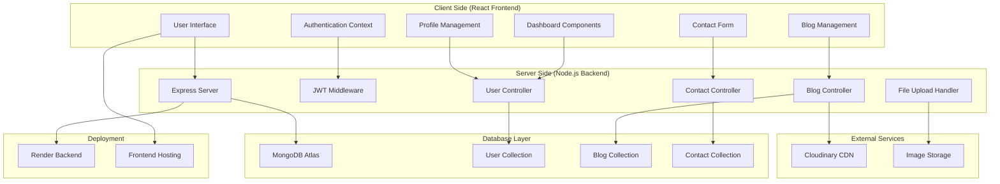
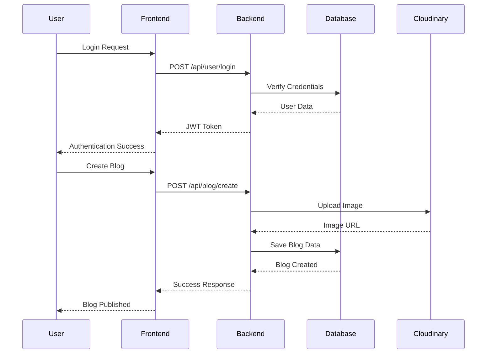
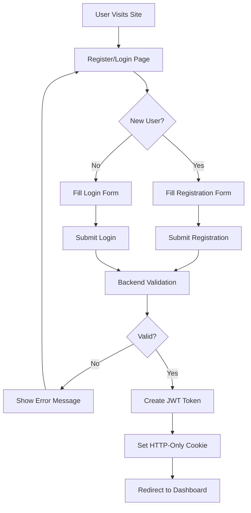
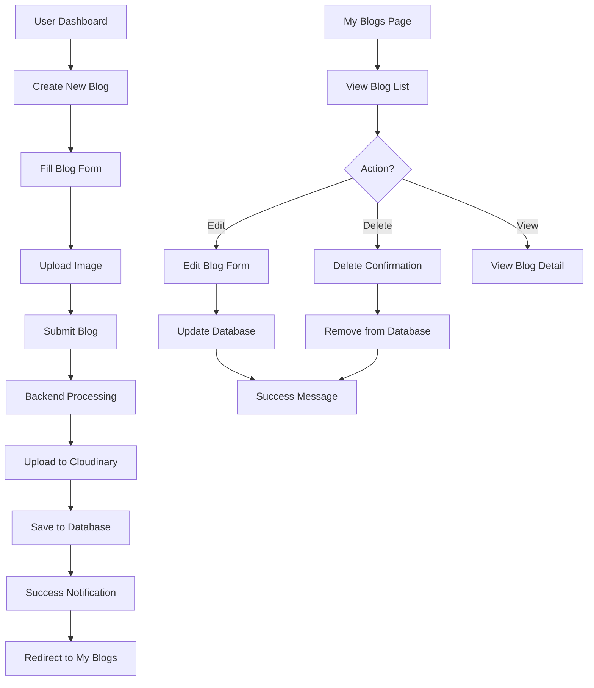

# 📖 blogForge - Full Stack Blog Application

A modern, full-stack blog application built with React and Node.js that allows users to create, manage, and share their blogs with a beautiful and responsive interface.

## ⚠️ Educational Project Disclaimer

**This project is developed for educational and learning purposes only.**

### Important Notes:
- 🎓 **Educational Purpose**: This project is created solely for learning full-stack development concepts
- 📊 **Dummy Data**: All metrics (views, likes, comments, etc.) are hard-coded/dummy values for demonstration
- 🚫 **Not Production Ready**: This project is not intended for production use
- 📝 **Third-party Content**: Any logos, names, or content used are for demonstration purposes only
- ⚖️ **No Ownership Claims**: We do not claim ownership of any third-party content or services used

### Data Explanation:
- **Views Count**: Randomly generated numbers for demonstration
- **Likes/Reactions**: Static values for UI demonstration
- **Comments**: Sample data for showcasing functionality
- **User Stats**: Mock data to show dashboard features

---

## 🌟 Features

### For Users
- **User Authentication** - Secure JWT-based login and registration system
- **Personal Dashboard** - Comprehensive profile and blog management
- **Blog Creation** - Rich text blog creation with image uploads via Cloudinary
- **Blog Management** - Edit, update, and delete your existing blogs
- **Responsive Design** - Fully responsive design that works on all devices
- **Blog Discovery** - Browse, search, and read blogs from other creators
- **Contact System** - Built-in contact form for user inquiries

### For Admins
- **User Management** - Manage user accounts and permissions
- **Content Moderation** - Review and manage blog content
- **Analytics Dashboard** - Track blog performance (with dummy data)

### Technical Features
- **JWT Authentication** - Secure token-based authentication with HTTP-only cookies
- **Image Upload** - Cloudinary integration for cloud-based image storage
- **Real-time Updates** - Dynamic content loading and state management
- **Contact System** - Built-in contact form with email notifications
- **Dark/Light Theme** - Toggle between dark and light modes
- **Toast Notifications** - Beautiful real-time user feedback

## 🛠️ Technology Stack

### Frontend
- **React 18** - Modern JavaScript library for building user interfaces
- **Vite** - Fast build tool and development server
- **Tailwind CSS** - Utility-first CSS framework for responsive styling
- **React Router Dom** - Client-side navigation and routing
- **Axios** - HTTP client for API communication
- **React Hot Toast** - Beautiful toast notifications
- **React Icons** - Comprehensive icon library
- **Framer Motion** - Smooth animations and transitions

### Backend
- **Node.js** - JavaScript runtime environment
- **Express.js** - Web application framework
- **MongoDB** - NoSQL database for data persistence
- **Mongoose** - MongoDB object modeling and schema validation
- **JWT** - JSON Web Tokens for secure authentication
- **Bcrypt** - Password hashing and security
- **Cloudinary** - Cloud-based image storage and processing
- **CORS** - Cross-origin resource sharing configuration
- **Express File Upload** - File upload handling middleware

### External Services
- **MongoDB Atlas** - Cloud database hosting
- **Cloudinary** - Image storage and CDN
- **Render** - Backend deployment platform

## 🏗️ Project Architecture

### System Flow Diagram



### Data Flow Architecture



## 📁 Detailed Project Structure

```
blogForge/
├── Backend/
│   ├── controller/              # Business Logic Layer
│   │   ├── blog.controller.js   # Blog CRUD operations
│   │   ├── contact.controller.js # Contact form handling
│   │   └── user.controller.js   # User authentication & management
│   ├── models/                  # Database Schema Layer
│   │   ├── blog.model.js        # Blog data model
│   │   ├── contact.model.js     # Contact message model
│   │   └── user.model.js        # User data model
│   ├── routes/                  # API Route Definitions
│   │   ├── blog.route.js        # Blog-related endpoints
│   │   ├── contact.route.js     # Contact-related endpoints
│   │   └── user.route.js        # User-related endpoints
│   ├── middleware/              # Custom Middleware
│   │   └── authUser.js          # JWT authentication middleware
│   ├── jwt/                     # JWT Utilities
│   │   └── authToken.js         # Token generation & verification
│   └── index.js                 # Main server file & configuration
│
├── Frontend/
│   ├── src/
│   │   ├── components/          # Reusable UI Components
│   │   │   ├── Footer.jsx       # Site footer component
│   │   │   ├── Home.jsx         # Homepage component
│   │   │   ├── Navbar.jsx       # Navigation component
│   │   │   ├── LoadMore.jsx     # Pagination component
│   │   │   └── Pagination.jsx   # Pagination controls
│   │   ├── pages/               # Main Page Components
│   │   │   ├── About.jsx        # About page
│   │   │   ├── Blogs.jsx        # Blog listing page
│   │   │   ├── Contact.jsx      # Contact form page
│   │   │   ├── Dashboard.jsx    # User dashboard
│   │   │   ├── Detail.jsx       # Blog detail view
│   │   │   ├── Login.jsx        # Login page
│   │   │   ├── Register.jsx     # Registration page
│   │   │   ├── Creators.jsx     # Creators listing
│   │   │   └── NotFound.jsx     # 404 error page
│   │   ├── dashboard/           # Dashboard-specific Components
│   │   │   ├── CreateBlog.jsx   # Blog creation form
│   │   │   ├── MyBlog.jsx       # User's blog listing
│   │   │   ├── MyProfile.jsx    # Profile management
│   │   │   ├── Update.jsx       # Blog editing form
│   │   │   └── Sidebar.jsx      # Dashboard sidebar
│   │   ├── home/                # Homepage Components
│   │   │   ├── Creator.jsx      # Featured creators
│   │   │   ├── Hero.jsx         # Hero section
│   │   │   └── Trending.jsx     # Trending blogs
│   │   ├── context/             # React Context Providers
│   │   │   ├── AuthProvider.jsx # Authentication context
│   │   │   └── ThemeProvider.jsx # Theme management
│   │   ├── utils/               # Utility Functions
│   │   ├── App.jsx              # Main application component
│   │   ├── main.jsx             # Application entry point
│   │   └── index.css            # Global styles
│   ├── public/                  # Static Assets
│   │   ├── blogforge-logo.svg   # Application logo
│   │   └── vite.svg             # Vite logo
│   └── dist/                    # Production Build Output
│
├── package.json                 # Root package configuration
└── README.md                    # Project documentation
```

## 🔄 Application Workflow

### User Registration & Authentication Flow



### Blog Creation & Management Flow



## 📚 Complete API Documentation

### Authentication Endpoints

| Method | Endpoint | Description | Request Body | Response |
|--------|----------|-------------|--------------|----------|
| POST | `/api/user/register` | Register new user | `{name, email, password, role, phone, education, photo}` | `{message, user, token}` |
| POST | `/api/user/login` | User login | `{email, password, role}` | `{message, user, token}` |
| GET | `/api/user/logout` | User logout | - | `{message}` |
| GET | `/api/user/getMyProfile` | Get user profile | - | `{user}` |
| GET | `/api/user/getAdmins` | Get all admin users | - | `{admins[]}` |

### Blog Endpoints

| Method | Endpoint | Description | Request Body | Response |
|--------|----------|-------------|--------------|----------|
| GET | `/api/blog/getBlog` | Get all blogs | - | `{blogs[]}` |
| GET | `/api/blog/getBlog/:id` | Get single blog | - | `{blog}` |
| GET | `/api/blog/myBlog` | Get user's blogs | - | `{blogs[]}` |
| POST | `/api/blog/create` | Create new blog | `{title, category, about, blogImage}` | `{message, blog}` |
| PUT | `/api/blog/updateBlog/:id` | Update blog | `{title, category, about, blogImage}` | `{message, blog}` |
| DELETE | `/api/blog/delete/:id` | Delete blog | - | `{message}` |

### Contact Endpoints

| Method | Endpoint | Description | Request Body | Response |
|--------|----------|-------------|--------------|----------|
| POST | `/api/contact/submitMessages` | Send contact message | `{name, email, message}` | `{message}` |
| GET | `/api/contact/getContact` | Get all contact messages | - | `{contacts[]}` |

## 🔐 Security Implementation

### Authentication Security
- **JWT Tokens**: Secure token-based authentication
- **HTTP-Only Cookies**: Tokens stored in secure cookies
- **Password Hashing**: Bcrypt with salt rounds
- **Input Validation**: Server-side validation for all inputs
- **CORS Configuration**: Restricted origin access

### Data Security
- **Environment Variables**: Sensitive data stored in environment variables
- **MongoDB Validation**: Schema validation at database level
- **File Upload Security**: File type and size validation
- **XSS Protection**: Input sanitization and output encoding

## 🎨 UI/UX Features

### Design System
- **Responsive Design**: Mobile-first approach with Tailwind CSS
- **Dark/Light Mode**: User preference with system detection
- **Loading States**: Skeleton loaders and spinners
- **Error Handling**: User-friendly error messages
- **Toast Notifications**: Real-time feedback system

### User Experience
- **Intuitive Navigation**: Clear navigation structure
- **Form Validation**: Real-time client-side validation
- **Image Optimization**: Automatic image compression and CDN delivery
- **Accessibility**: ARIA labels and keyboard navigation support

## 📊 Database Schema

### User Model
```javascript
{
  name: String,
  email: String (unique),
  password: String (hashed),
  role: String (user/admin),
  phone: String,
  education: String,
  photo: String (Cloudinary URL),
  createdAt: Date,
  updatedAt: Date
}
```

### Blog Model
```javascript
{
  title: String,
  category: String,
  about: String,
  blogImage: String (Cloudinary URL),
  user: ObjectId (ref: User),
  createdAt: Date,
  updatedAt: Date
}
```

### Contact Model
```javascript
{
  name: String,
  email: String,
  message: String,
  createdAt: Date
}
```

## 🚀 Deployment Guide

### Backend Deployment (Render)
1. **Connect Repository**: Link your GitHub repository to Render
2. **Configure Build Settings**:
   - Build Command: `npm install`
   - Start Command: `npm start`
3. **Environment Variables**:
   ```
   PORT=10000
   MONGODB_URL=your_mongodb_atlas_url
   JWT_SECRET=your_jwt_secret
   CLOUD_NAME=your_cloudinary_name
   CLOUD_API_KEY=your_cloudinary_api_key
   CLOUD_SECRET_KEY=your_cloudinary_secret_key
   ```
4. **Deploy**: Automatic deployment on git push

### Frontend Deployment (Vercel/Netlify)
1. **Connect Repository**: Link your GitHub repository
2. **Configure Build Settings**:
   - Build Command: `npm run build`
   - Output Directory: `dist`
3. **Environment Variables** (if needed):
   ```
   VITE_API_URL=https://your-backend-url.onrender.com
   ```
4. **Deploy**: Automatic deployment on git push

## 🧪 Testing & Development

### Local Development Setup

#### Backend Development
```bash
cd Backend
npm install
npm run dev  # Uses nodemon for auto-restart
```

#### Frontend Development
```bash
cd Frontend
npm install
npm run dev  # Starts Vite dev server
```

### Environment Configuration
Create `.env` file in Backend directory:
```env
PORT=4000
MONGODB_URL=mongodb://localhost:27017/blogforge
JWT_SECRET=your_super_secret_jwt_key
CLOUD_NAME=your_cloudinary_cloud_name
CLOUD_API_KEY=your_cloudinary_api_key
CLOUD_SECRET_KEY=your_cloudinary_secret_key
```

## 📈 Performance Optimization

### Frontend Optimizations
- **Code Splitting**: Lazy loading of components
- **Image Optimization**: WebP format with fallbacks
- **Bundle Analysis**: Vite bundle analyzer
- **Caching**: HTTP caching headers
- **Compression**: Gzip compression

### Backend Optimizations
- **Database Indexing**: Optimized MongoDB queries
- **Connection Pooling**: Efficient database connections
- **Caching**: Redis caching for frequently accessed data
- **Rate Limiting**: API rate limiting protection

## 🔧 Troubleshooting

### Common Issues

#### CORS Errors
```javascript
// Ensure CORS is properly configured
app.use(cors({
  origin: 'https://your-frontend-url.com',
  credentials: true
}));
```

#### MongoDB Connection Issues
```javascript
// Check connection string format
mongoose.connect(MONGGO_URL, {
  useNewUrlParser: true,
  useUnifiedTopology: true
});
```

#### Image Upload Issues
```javascript
// Verify Cloudinary configuration
cloudinary.config({
  cloud_name: process.env.CLOUD_NAME,
  api_key: process.env.CLOUD_API_KEY,
  api_secret: process.env.CLOUD_SECRET_KEY,
});
```

## 🤝 Contributing Guidelines

### Development Workflow
1. **Fork** the repository
2. **Create** a feature branch (`git checkout -b feature/amazing-feature`)
3. **Commit** your changes (`git commit -m 'Add amazing feature'`)
4. **Push** to the branch (`git push origin feature/amazing-feature`)
5. **Open** a Pull Request

### Code Standards
- **ESLint**: Follow the configured linting rules
- **Prettier**: Use consistent code formatting
- **Comments**: Add meaningful comments for complex logic
- **Error Handling**: Implement proper error handling

## 📝 License

This project is open source and available under the [MIT License](LICENSE).

## 👨‍💻 Developer Information

**Developer**: H-05  
**Role**: Full Stack Developer  
**Contact**: Available through the application's contact form

## 🔗 Live Demo

- **Backend API**: [https://hiten-blogforge-1.onrender.com](https://hiten-blogforge-1.onrender.com)
- **API Documentation**: Available at `/api` endpoint

## 📞 Support & Contact

For questions, issues, or contributions:
- 📧 **Email**: Use the contact form in the application
- 🐛 **Issues**: Open an issue in the repository
- 💬 **Discussions**: Use GitHub Discussions for questions

---

## ⚠️ Final Disclaimer

**This project is created purely for educational purposes to demonstrate full-stack development concepts. All data, metrics, and content are for demonstration purposes only and do not represent real user interactions or authentic data.**

**Happy Learning! 🎓📝✨**