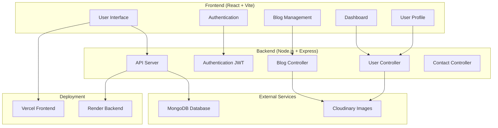

# 📖 blogForge - Full Stack Blog Application

A modern, full-stack blog application built with React and Node.js that allows users to create, manage, and share their blogs with a beautiful and responsive interface.

## 🌟 Features

### For Users
- **User Authentication** - Secure login and registration system
- **Personal Dashboard** - Manage your profile and blogs
- **Blog Creation** - Write and publish blogs with image uploads
- **Blog Management** - Edit and update your existing blogs
- **Responsive Design** - Works perfectly on all devices
- **Blog Discovery** - Browse and read blogs from other creators

### For Admins
- **User Management** - Manage user accounts and permissions
- **Content Moderation** - Review and manage blog content
- **Analytics Dashboard** - Track blog performance and user engagement

### Technical Features
- **JWT Authentication** - Secure token-based authentication
- **Image Upload** - Cloudinary integration for image storage
- **Real-time Updates** - Dynamic content loading
- **Contact System** - Built-in contact form for user inquiries

## 🛠️ Technology Stack

### Frontend
- **React 18** - Modern JavaScript library for building user interfaces
- **Vite** - Fast build tool and development server
- **Tailwind CSS** - Utility-first CSS framework for styling
- **React Router Dom** - Navigation and routing
- **Axios** - HTTP client for API calls
- **React Hot Toast** - Beautiful notifications
- **React Icons** - Icon library

### Backend
- **Node.js** - JavaScript runtime environment
- **Express.js** - Web application framework
- **MongoDB** - NoSQL database for data storage
- **Mongoose** - MongoDB object modeling
- **JWT** - JSON Web Tokens for authentication
- **Bcrypt** - Password hashing
- **Cloudinary** - Cloud-based image storage
- **CORS** - Cross-origin resource sharing
- **Multer** - File upload handling

### Deployment
- **Frontend**: Deployed on Vercel
- **Backend**: Deployed on Render
- **Database**: MongoDB Atlas (Cloud)
- **Images**: Cloudinary (Cloud Storage)

## 📋 Prerequisites

Before you begin, ensure you have the following installed:
- **Node.js** (version 14 or higher)
- **npm** or **yarn** package manager
- **MongoDB** (local installation or MongoDB Atlas account)
- **Git** for version control

## 🚀 Getting Started

### 1. Clone the Repository
```bash
git clone <repository-url>
cd blogForge
```

### 2. Backend Setup

#### Navigate to Backend Directory
```bash
cd Backend
```

#### Install Dependencies
```bash
npm install
```

#### Environment Variables
Create a `.env` file in the Backend directory with the following variables:
```env
PORT=4000
MONGODB_URL=your_mongodb_connection_string
JWT_SECRET=your_jwt_secret_key
CLOUD_NAME=your_cloudinary_cloud_name
CLOUD_API_KEY=your_cloudinary_api_key
CLOUD_SECRET_KEY=your_cloudinary_secret_key
```

#### Start Backend Server
```bash
npm start
```

The backend server will start on `http://localhost:4000`

### 3. Frontend Setup

#### Navigate to Frontend Directory
```bash
cd Frontend
```

#### Install Dependencies
```bash
npm install
```

#### Start Development Server
```bash
npm run dev
```

The frontend application will start on `http://localhost:5173`

## 📁 Project Structure

```
blogForge/
├── Backend/
│   ├── controller/          # API controllers
│   │   ├── blog.controller.js
│   │   ├── contact.controller.js
│   │   └── user.controller.js
│   ├── models/             # Database models
│   │   ├── blog.model.js
│   │   ├── contact.model.js
│   │   └── user.model.js
│   ├── routes/             # API routes
│   │   ├── blog.route.js
│   │   ├── contact.route.js
│   │   └── user.route.js
│   ├── middleware/         # Custom middleware
│   │   └── authUser.js
│   ├── jwt/               # JWT utilities
│   │   └── authToken.js
│   └── index.js           # Main server file
│
├── Frontend/
│   ├── src/
│   │   ├── components/    # Reusable components
│   │   │   ├── Footer.jsx
│   │   │   ├── Home.jsx
│   │   │   └── Navbar.jsx
│   │   ├── pages/         # Page components
│   │   │   ├── About.jsx
│   │   │   ├── Blogs.jsx
│   │   │   ├── Contact.jsx
│   │   │   ├── Dashboard.jsx
│   │   │   ├── Login.jsx
│   │   │   └── Register.jsx
│   │   ├── dashboard/     # Dashboard components
│   │   │   ├── CreateBlog.jsx
│   │   │   ├── MyBlog.jsx
│   │   │   ├── MyProfile.jsx
│   │   │   └── Update.jsx
│   │   ├── context/       # React context
│   │   │   └── AuthProvider.jsx
│   │   └── App.jsx        # Main app component
│   └── index.html
```

## 🎯 Application Architecture



## 📚 API Endpoints

### User Routes
- `POST /api/user/register` - Register new user
- `POST /api/user/login` - User login
- `GET /api/user/logout` - User logout
- `GET /api/user/getMyProfile` - Get user profile
- `GET /api/user/getAdmins` - Get all admin users

### Blog Routes
- `GET /api/blog/getBlog` - Get all blogs
- `POST /api/blog/createBlog` - Create new blog
- `PUT /api/blog/updateBlog/:id` - Update blog
- `DELETE /api/blog/deleteBlog/:id` - Delete blog
- `GET /api/blog/singleBlog/:id` - Get single blog
- `GET /api/blog/myBlog` - Get user's blogs

### Contact Routes
- `POST /api/contact/send` - Send contact message
- `GET /api/contact/getContact` - Get all contact messages

## 🔐 Authentication

The application uses JWT (JSON Web Tokens) for authentication:
- Tokens are stored in HTTP-only cookies for security
- Authentication is required for most features
- Role-based access control (user/admin)

## 📱 User Roles

### User
- Create and manage personal blogs
- View and read other blogs
- Update personal profile
- Send contact messages

### Admin
- All user permissions
- Manage other users
- View contact messages
- Content moderation capabilities

## 🎨 UI/UX Features

- **Responsive Design** - Works on desktop, tablet, and mobile
- **Dark/Light Mode** - User preference support
- **Toast Notifications** - Real-time feedback
- **Loading States** - Smooth user experience
- **Error Handling** - Graceful error management

## 🚀 Deployment

### Frontend (Vercel)
1. Connect your GitHub repository to Vercel
2. Configure build settings:
   - Build Command: `npm run build`
   - Output Directory: `dist`
3. Deploy automatically on git push

### Backend (Render)
1. Connect your GitHub repository to Render
2. Configure environment variables
3. Deploy with automatic builds

## 🤝 Contributing

1. Fork the repository
2. Create a feature branch (`git checkout -b feature/AmazingFeature`)
3. Commit your changes (`git commit -m 'Add some AmazingFeature'`)
4. Push to the branch (`git push origin feature/AmazingFeature`)
5. Open a Pull Request

## 📝 License

This project is open source and available under the [MIT License](LICENSE).

## 👨‍💻 Developer

**H-05** - Full Stack Developer

## 🔗 Live Demo

- **Frontend**: [https://hiten-blog-forge.vercel.app](https://hiten-blog-forge.vercel.app)
- **Backend API**: [https://hiten-blogforge.onrender.com](https://hiten-blogforge.onrender.com)

## 📞 Support

If you have any questions or need help with setup, please feel free to:
- Open an issue in the repository
- Contact through the application's contact form
- Reach out to the developer

---

**Happy Blogging! 📝✨** 